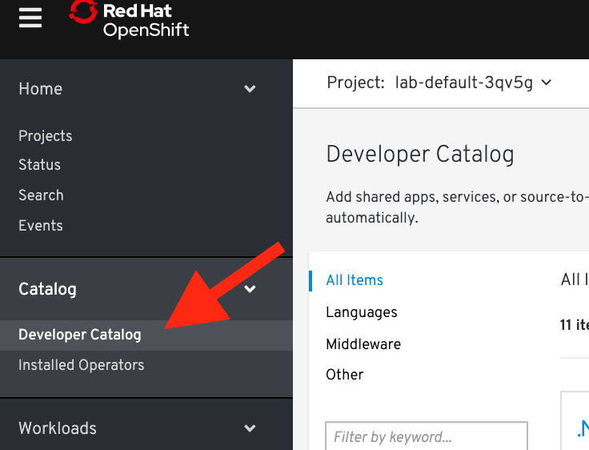
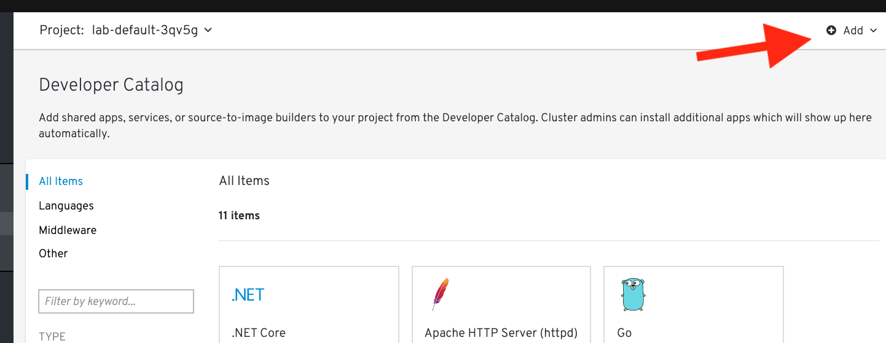
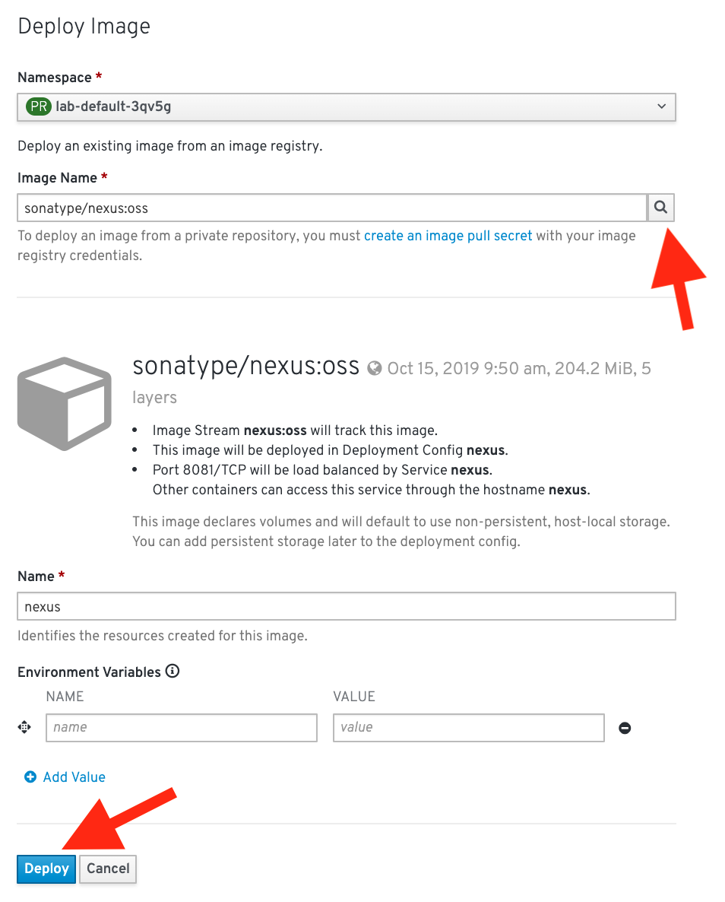
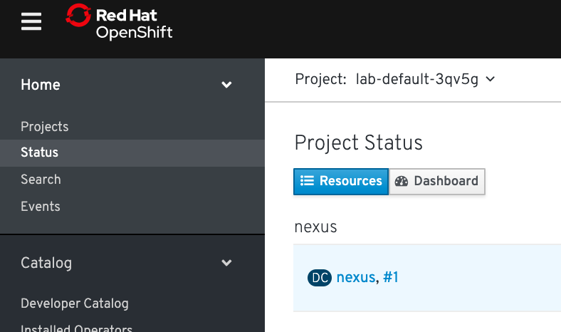
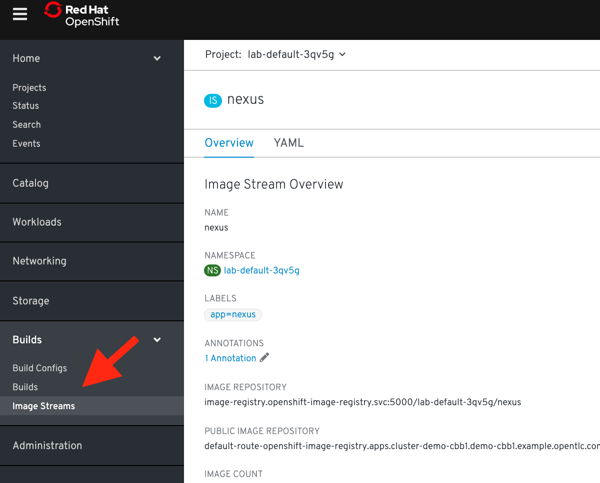
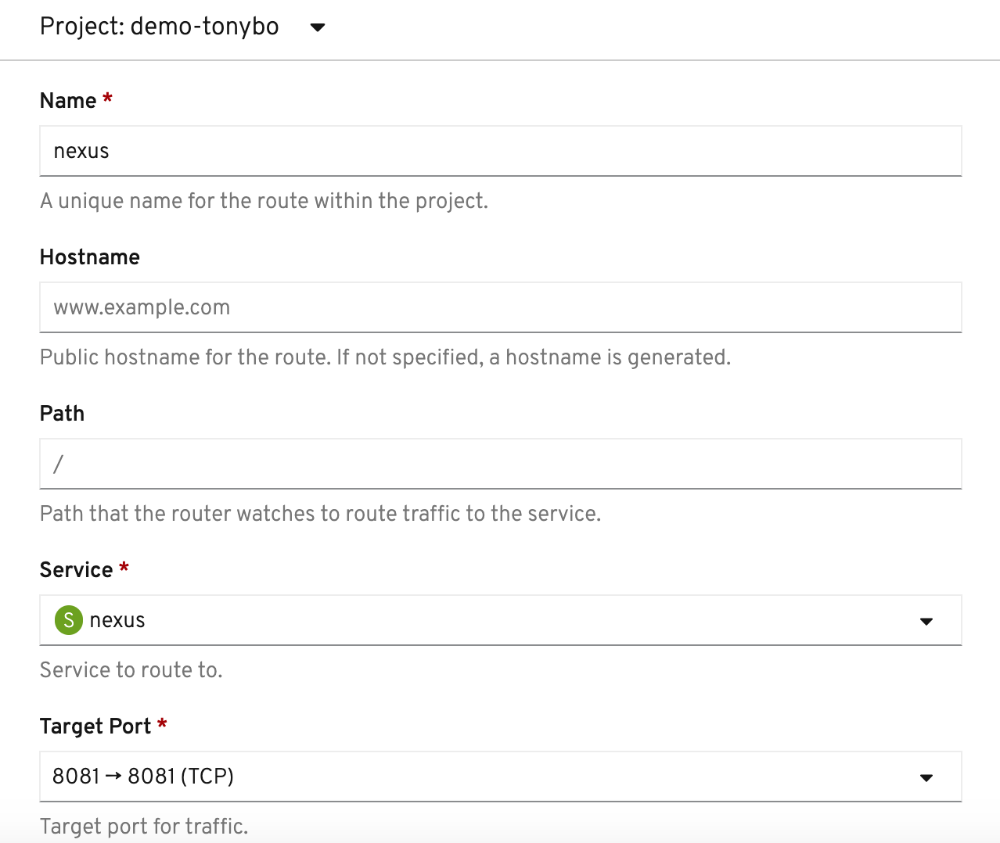
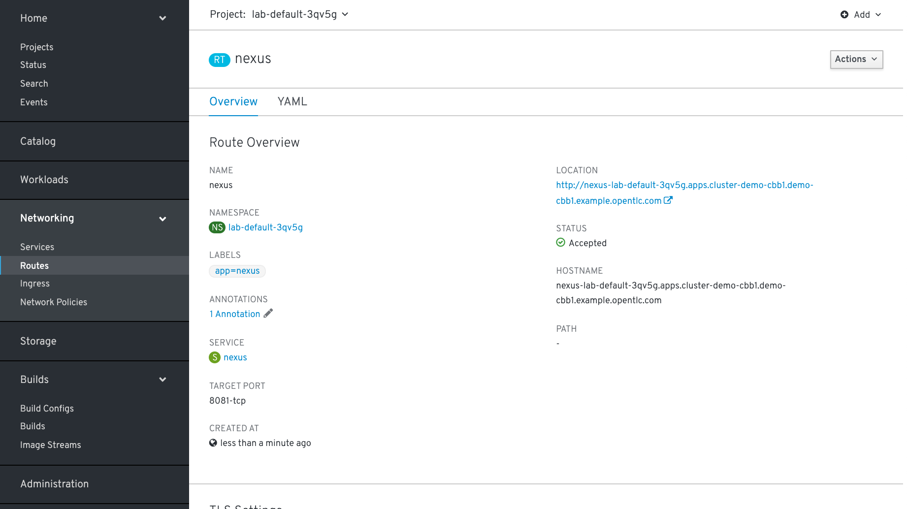
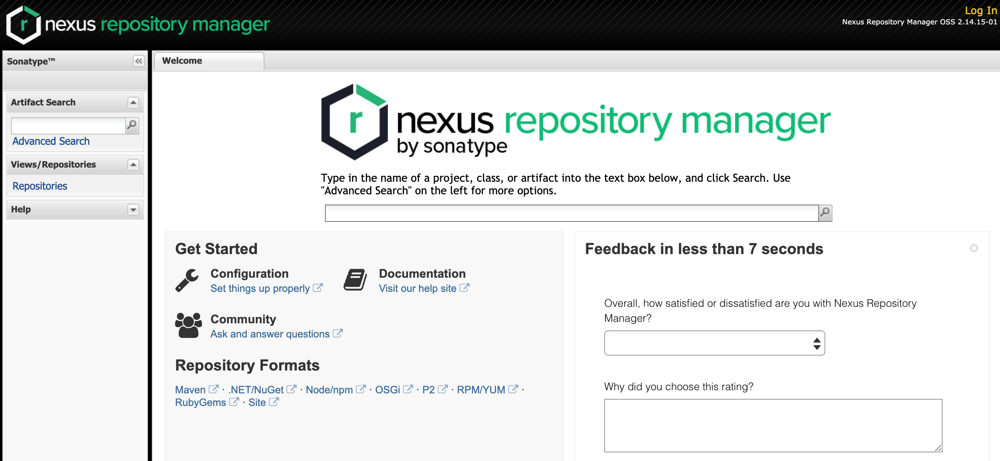

### Bring your own Docker

It's easy to get started with OpenShift whether you're using our app templates or bringing your existing docker assets. In this quick lab we will deploy an application using an exisiting docker image. OpenShift will create an image stream for the image as well as deploy and manage containers based on that image. And we will dig into the details to show how all that works.

When going through this lab, follow either:
```
Option 1 (CLI Instructions)
```
or 
```
Option 2 (Web Console Instructions)
```

#### Let's point OpenShift to an existing built docker image

Here we're going to deploy an existing image from a docker registry via CLI or the Web Console.

##### CLI Instructions (Option 1)

Run the following command inside the terminal: 
```execute
oc new-app sonatype/nexus:oss
```

Your output from the command above should be *similar* to the following: 

```
--> Found Docker image adffc23 (13 days old) from Docker Hub for "sonatype/nexus:oss"
    * An image stream tag will be created as "nexus:oss" that will track this image
    * This image will be deployed in deployment config "nexus"
    * Port 8081/tcp will be load balanced by service "nexus"
      * Other containers can access this service through the hostname "nexus"
    * This image declares volumes and will default to use non-persistent, host-local storage.
      You can add persistent volumes later by running 'volume dc/nexus --add ...'
--> Creating resources ...
    imagestream.image.openshift.io "nexus" created
    deploymentconfig.apps.openshift.io "nexus" created
    service "nexus" created
--> Success
    Application is not exposed. You can expose services to the outside world by executing one or more of the commands below:
     'oc expose svc/nexus' 
    Run 'oc status' to view your app.
```
<br>

##### Web Console Instructions (Option 2)

On the left navbar of the Web Console click on ```Catalog``` > [Developer Catalog](%console_url%/catalog/ns/demo-%username%)



Make sure you're in the correct project: 

```
demo-%username%
```

In the ```Developer Catalog``` on the right hand side, look for the ```Add``` button and click on it: 



Click the ```Deploy Image``` option and under ```Image Name``` enter:

``` 
sonatype/nexus:oss
```

Then click the magnifying glass to the far right to search for the image. Leave all the settings as default and click ```Deploy```:



It should automatically redirect you to ```Home``` > ["Status"](%console_url%/overview/ns/demo-%username%). Your view should list a nexus resource:



#### Browsing our Project Details

We're going to take a look at our Project's details using either the CLI or Web console next.

##### CLI Instructions (Option 1)

Switch back over to the terminal tab in your lab

Try typing the following to see what is available to 'get':

```execute
oc get all
```

Now let's look at what our image stream has in it:

```execute
oc get is
```

Getting more information from the nexus image stream: 

```execute
oc describe is/nexus
```

>An image stream can be used to automatically perform an action, such as updating a deployment, when a new image, in our case a new version of the nexus image, is created. 

<br>

##### Web Console Instructions (Option 2)

Similarly, you can also see the same details in the Web Console

On the left navbar click on ```Builds``` > [Image Streams](%console_url%/k8s/ns/demo-%username%/imagestreams). Click on ```nexus``` to see more details about your image stream:



#### Accessing your Nexus App

Next, we want to be able to access the nexus application we just deployed from the docker registry. This means being able to create a URL that we can access via the web browser. 

##### CLI Instructions (Option 1)

Execute this command in the CLI to create a route to our Nexus Application by exposing the service already running:

```execute
oc expose service nexus
```

The resource will be created for the route, then you can run this command to get the url to access your nexus application:

```execute
oc get route nexus
```

Your route should be something like this: 
```
http://nexus-%project_namespace%.%cluster_subdomain%
```

<br>

##### Web Console Instructions (Option 2)

On the left nav bar, navigate to ```Networking``` > [Routes](%console_url%/k8s/ns/demo-%username%/routes). Then, click ```Create Route```:


Name your route ```nexus```. In the Service dropdown, select nexus. In the Target Port dropdown select ```8081->8081 (TCP)```: 



Leave everything else as the default, scroll down, and click ```Create```. Your route information should show up as a url under location on the right side: 



<br>

#### Test out the Nexus WebApp Route

Click on the url and open into a new tab or navigate to the route you exposed in the terminal from before:

```
http://nexus-lab-%project_namespace%.%cluster_subdomain%
```

You should encounter this error:


Good work - this error is expected; since the nexus source directory is actually is on /nexus

Add /nexus at the end of the url, like this:

```
http://nexus-lab-%project_namespace%.%cluster_subdomain%/nexus
```

Of course, we have not provided persistent storage; so, any and all work will be lost.



<br>

#### Let's clean this up

Navigate to the terminal tab in your workshop and run the following command:

```execute
oc delete all --all
```

<br>

#### Summary

In this lab you've deployed an example docker image, pulled from docker hub, into a pod running in OpenShift. You exposed a route for clients to access that service via thier web browsers. And you learned how to get and describe resources using the command line and the web console. Hopefully, this basic lab also helped to get you familiar with using the CLI and navigating within the web console.


