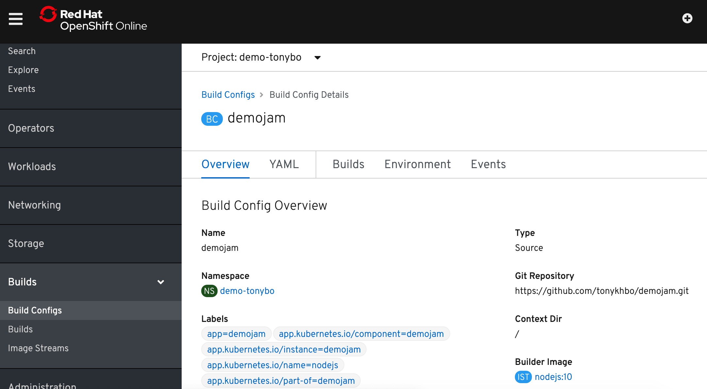
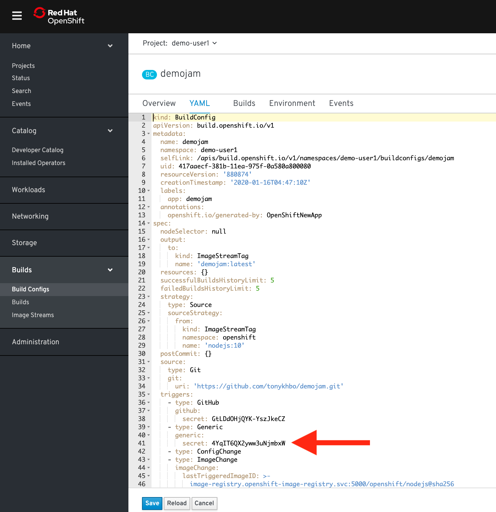
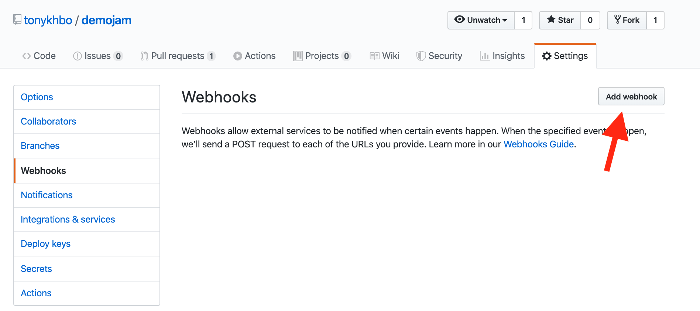
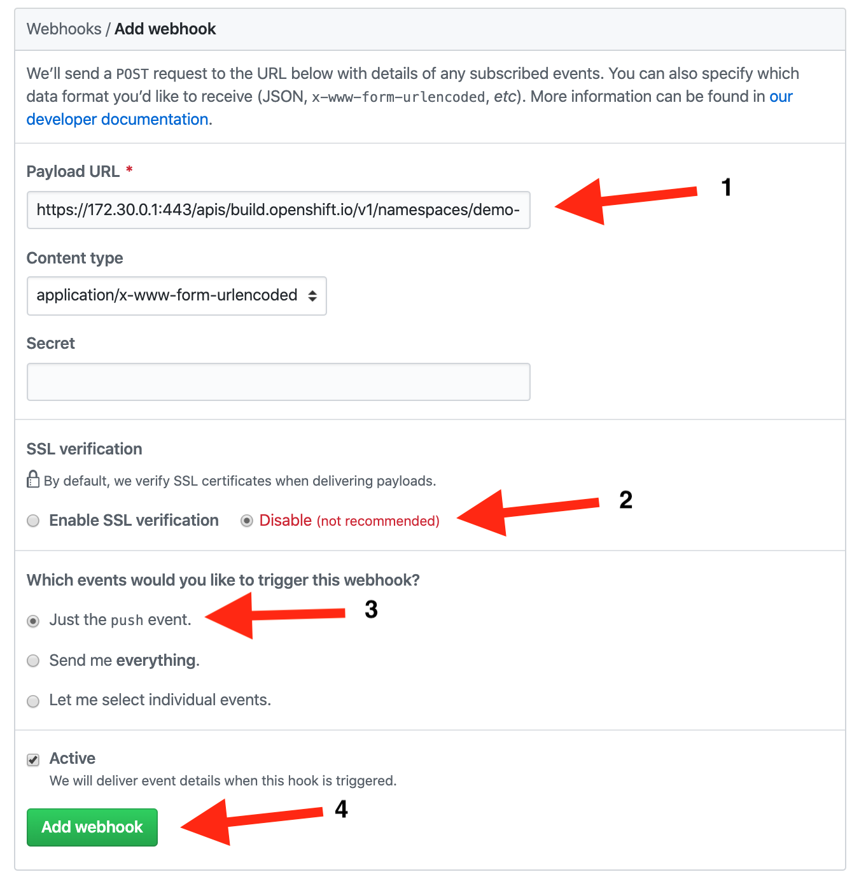

### Build Triggers, Webhooks and Rollbacks

Once you have an app deployed in OpenShift you can take advantage of some continuous capabilities that help to enable DevOps and automate your management process. We will cover some of those in this lab: Build triggers, webhooks, and rollbacks.

#### Using Github
We are going to do some integration and coding with an external git repository. For this lab we are going to use github, if you don't already have an account, you can create one [here](https://github.com/join)

OK, let's fork the demojam app into your github account. Go to this [link](https://github.com/tonykhbo/demojam) or type https://github.com/tonykhbo/demojam into a new tab. Look to the top right for the ```Fork``` button.


Click the ```Fork``` button and Github should redirect you to the newly created fork of the source code.

#### Build Trigger / Code Change Webhook

When using S2I there are a few different things that can be used to trigger a rebuild of your source code. The first is a configuration change, the second is an image change, and the last (which we are covering here) is a webhook. A webhook is basically your git source code repository telling OpenShift that the code we care about has changed. Let's set that up for our project now to see it in action.

Let's create a new demojam app but with your git repository that you just forked.

In the terminal, run the following command but with your github username in place of ```[YOUR_ACCOUNT]```:

```
oc new-app --name=demojam https://github.com/[YOUR_ACCOUNT]/demojam.git
```

#### Grabbing the Webhooks

When using the ```oc new-app``` and ```oc new-build```, GitHub and Generic webhook triggers will be created automatically, but any other needed webhook triggers must be added manually. You can execute ```oc set trigger --help``` in the CLI for more information.

##### *CLI Instructions (Option 1)*

Inside the terminal, run the following command: 

```execute
oc describe bc/demojam | grep -i webhook
```

Example output: 

```
Webhook Generic:
        URL:            https://172.30.0.1:443/apis/build.openshift.io/v1/namespaces/demo-user1/buildconfigs/demojam/webhooks/<secret>/generic
```

Copy this webhook, but we still need the ```<secret>``` of the webhook before we can use it.

In the web console, from the left navbar, navigate to ```Builds``` > [Builds Config](%console_url%/k8s/ns/demo-%username%/buildconfigs). Click on the ```YAML``` tab between ```Overview``` and ```Builds```:



Copy the generic webhook secret: 



Combine your generic webhook url and secret, you should have something like this:

```
https://172.30.0.1:443/apis/build.openshift.io/v1/namespaces/demo-user1/buildconfigs/demojam/webhooks/4YqIT6QX2yww3uNjmbxW/generic
```

#### Jump back over to Github

After copying down the Webhook URL from the CLI Instructions or Web Console instructions, navigate back to your forked repository on github. 

Click on the ```Settings``` > ```Webhooks``` on the left navbar.
Click the ```Add Webhook``` button on the right side:



Paste in the generic webhook url you copied into ```Payload URL```. Next, click ```Disable SSL Verification``` and leave the rest of the settings as default. Finally, click the green ```Add Webhook``` button at the bottom: 



Good work! Now any ```push``` to the forked repository will send a webhook that triggers OpenShift to: re-build the code and image using s2i, and then perform a new pod deployment. In fact Github should have sent a test trigger and OpenShift should have kicked off a new build already.

##### Deployment Triggers

In addition to setting up triggers for rebuilding code, we can setup a different type of trigger to deploy pods. Deployment triggers can be due to a configuration change (e.g. environment variables) or due to an image change. This powerful feature will be covered in one of the advanced labs. See the Triggers link under More Information below.

#### Rollbacks

Well, what if something isn't quite right with the latest version of our app? Let's say some feature we thought was ready for the world really isn't - and we didn't figure that out until after we deployed it. No problem, we can roll it back with the click of a button. 

In the terminal, run the following command:

```execute
oc rollback demojam-1
```

Check the status of your pods:

```execute
oc get pods -w
```

OpenShift has done a graceful removal of the old pod and created a new one.

> Note that the old pod wasn't killed until the new pod was successfully started and ready to be used. This is so that OpenShift could continue to route traffic to the old pod until the new one was ready.

>You can integrate your CI/CD tools to do rollbacks with the REST API. See the Rollbacks With the REST API link under More Information below.

<br>

#### Summary

In this lab we saw how you can configure a source code repository to trigger builds with webhooks. This webhook could come from Github, Jenkins, Travis-CI, or any tool capable of sending a URL POST. Keep in mind that there are other types of build triggers you can setup. For example: if a new version of the upstream RHEL image changes. We also inspected our deployment history and did a rollback of our running deployment to one based on an older image with the click of a button.

##### More information

[Triggers](https://docs.openshift.com/container-platform/4.2/builds/triggering-builds-build-hooks.html)

[Deployment Configs and Rollbacks](https://docs.openshift.com/container-platform/4.2/applications/deployments/what-deployments-are.html)


